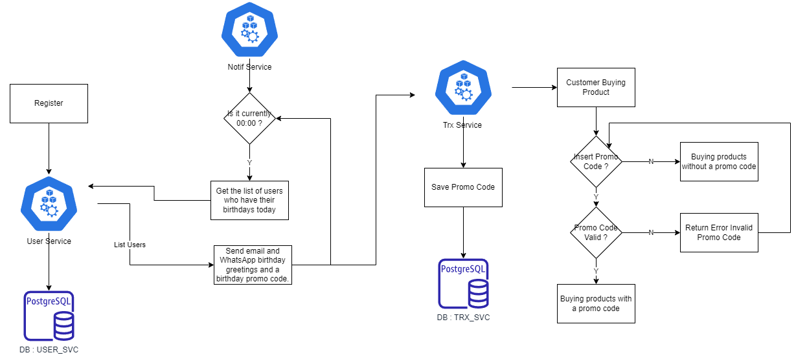
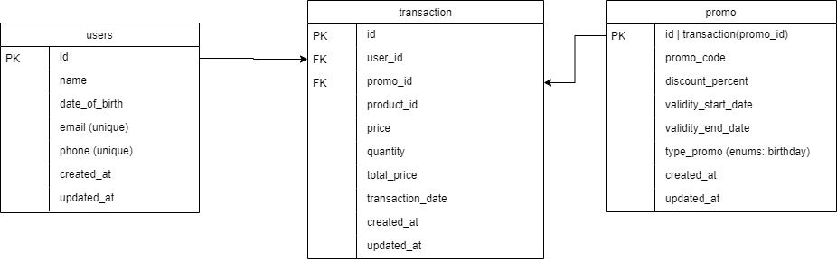

# go_test_scheduler

## Scenario
Your system needs to implement a daily scheduler with the purpose of sending a Happy
Birthday email / WhatsApp message and dynamically create a Promo that is valid for the current
date & current verified birthday users only. The user is then able to buy any Sayakaya product
using the created Promo.   

## Flowchart Diagram

## Database Design

## NOTES
_The architecture and database design may change, this is just for example purposes only._